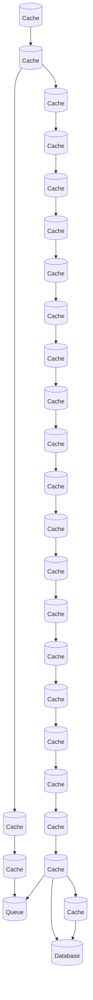

# Architecture Diagram
Last updated: 2026-02-17 23:05:43 UTC

## Overview

The architecture consists of a Cache layer that facilitates fast data retrieval and a Database for persistent storage. Data flows through multiple Cache components, which optimize access speed before reaching a Queue for asynchronous processing. The final Cache component also interacts with the Database, ensuring that data is stored and retrieved efficiently.
