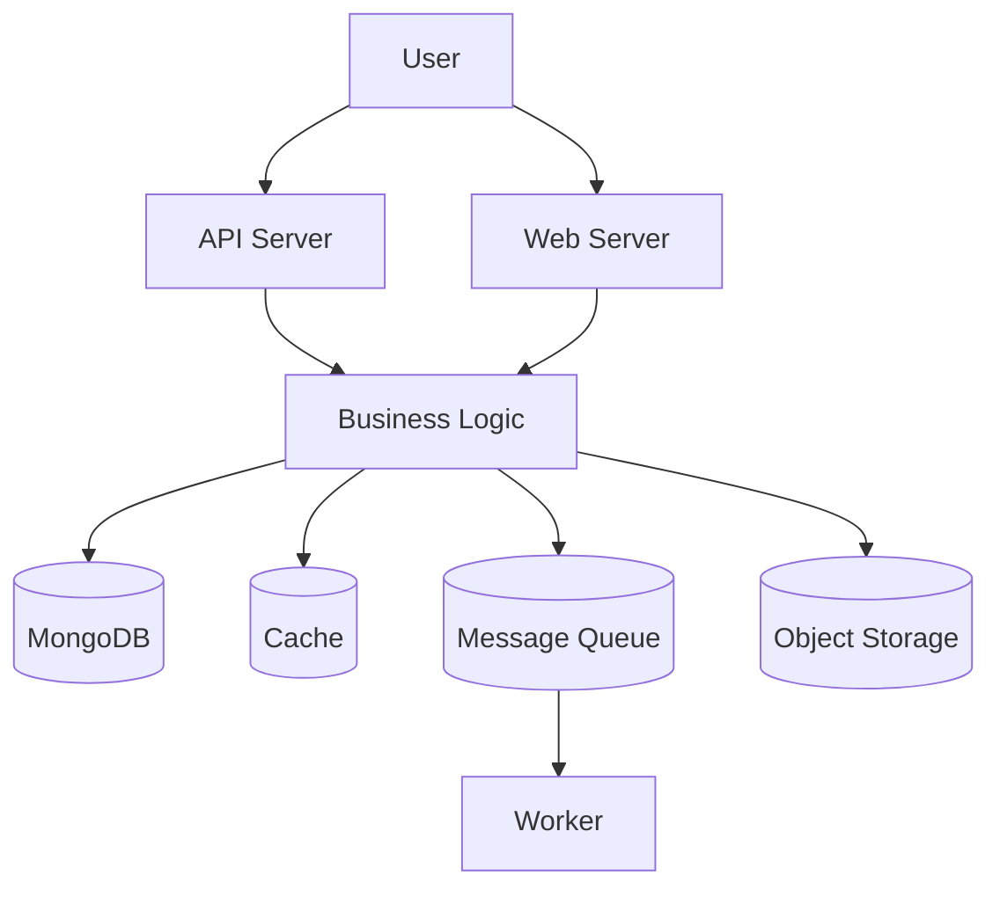

# Architecture Diagram
Last updated: 2026-01-08 01:12:56 UTC

## Overview

The architecture consists of an API Server and a Web Server that handle user requests, directing them to the Business Logic for processing. The Business Logic interacts with MongoDB for data storage, utilizes Cache for improved performance, and communicates with a Message Queue for asynchronous task handling, which is processed by Worker components. Additionally, the Business Logic can store large files in Object Storage, ensuring efficient data management.
