# Architecture Diagram
Last updated: 2026-02-17 23:05:43 UTC

```mermaid
graph TB
    Cache[(Cache)] -->|cache| Cache1[(Cache)]
    Cache1 -->|cache| Cache2[(Cache)]
    Cache2 -->|cache| Cache3[(Cache)]
    Cache3 -->|cache| Cache4[(Cache)]
    Cache4 -->|cache| Cache5[(Cache)]
    Cache5 -->|cache| Cache6[(Cache)]
    Cache6 -->|cache| Cache7[(Cache)]
    Cache7 -->|cache| Cache8[(Cache)]
    Cache8 -->|cache| Cache9[(Cache)]
    Cache9 -->|cache| Cache10[(Cache)]
    Cache10 -->|cache| Cache11[(Cache)]
    Cache11 -->|cache| Cache12[(Cache)]
    Cache12 -->|cache| Cache13[(Cache)]
    Cache13 -->|cache| Cache14[(Cache)]
    Cache14 -->|cache| Cache15[(Cache)]
    Cache15 -->|cache| Cache16[(Cache)]
    Cache16 -->|cache| Cache17[(Cache)]
    Cache17 -->|cache| Cache18[(Cache)]
    Cache18 -->|cache| Cache19[(Cache)]
    Cache19 -->|cache| Cache20[(Cache)]
    Cache20 -->|cache| Cache21[(Cache)]
    Cache21 -->|cache| Cache22[(Cache)]
    Cache22 -->|cache| Cache23[(Cache)]
    Cache23 -->|cache| Cache24[(Cache)]
    Cache24 -->|cache| Queue[(Queue)]
    Cache24 -->|cache| Database[(Database)]
    Cache23 -->|cache| Database
```

## Overview

The architecture consists of a series of Cache components that facilitate data retrieval and storage efficiency. Data flows through multiple Cache layers, enhancing performance by reducing the load on the Database, which serves as the persistent storage for the application. Additionally, a Queue component is integrated to manage asynchronous tasks, allowing for smooth data processing and communication between the Cache and Database.
